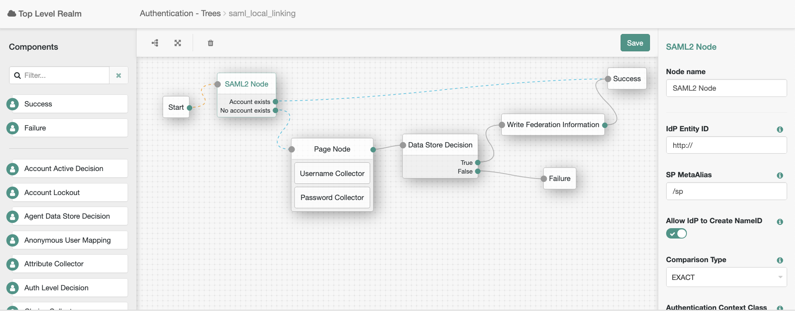

<!--
 * The contents of this file are subject to the terms of the Common Development and
 * Distribution License (the License). You may not use this file except in compliance with the
 * License.
 *
 * You can obtain a copy of the License at legal/CDDLv1.0.txt. See the License for the
 * specific language governing permission and limitations under the License.
 *
 * When distributing Covered Software, include this CDDL Header Notice in each file and include
 * the License file at legal/CDDLv1.0.txt. If applicable, add the following below the CDDL
 * Header, with the fields enclosed by brackets [] replaced by your own identifying
 * information: "Portions copyright [year] [name of copyright owner]".
 *
 * Copyright 2019 ForgeRock AS.
-->
# SAML2Node

The SAML2 authentication node lets administrators integrate SAML v2.0 single sign-on into an AM authentication trees.

You use the SAML2 authentication node when deploying SAML v2.0 single sign-on in integrated mode. In addition to 
configuring the SAML2 authentication node properties, integrated mode deployment requires that you make several 
changes to service provider configurations. Before attempting to configure a SAML2 authentication node instance, 
review  ["Implementing SAML v2.0 Single Sign-On in Integrated Mode"](https://backstage.forgerock.com/docs/am/6.5/saml2-guide/index.html#saml2-integrated-mode-sso)
in the SAML v2.0 Guide and make sure that you have made any required changes to your service provider configuration.

**Note:** These nodes will only work with Access Management 6.5.2 and above.

## Usage

To deploy these nodes, download the jar from the releases tab on github 
[here](https://github.com/FrankGasparovic/SAML2Node6.5/releases/latest). Next, copy the jar into the 
../web-container/webapps/openam/WEB-INF/lib directory where AM is deployed. Restart the web container to pick up the 
new node. The node will then appear in the authentication trees components palette.

### SAML2 Node Configuration
* **IdP Entity ID** - Specifies the identity provider (IdP) for authentication requests to this module. Specify the name 
of a SAML v2.0 entity provider that is defined in the SAML2 authentication module's realm. You can find configured 
entity providers in the AM console under Federation. The Realm column identifies the realm in which an entity provider 
has been configured.
* **SP MetaAlias** - Specifies the local alias for the service provider (SP). For service providers configured in the
 Top Level Realm, use the format /SP Name. For service providers configured in subrealms, use the format /Realm  
 Name/SP Name. To find the local aliases for entity providers in the AM console, navigate to Realms > Realm Name > 
 Applications > Federation > Entity Providers > Entity Provider Name > Services.
* **Allow IdP to Create NameID** - Specifies whether the IdP should create a new identifier for the authenticating user 
 if none exists. A value of true permits the IdP to create an identifier for the authenticating user if none exists. 
 A value of false indicates a request to constrain the IdP from creating an identifier. For detailed information, 
 see the section on the AllowCreate property in 
 [SAML Version 2.0 Errata 05](http://docs.oasis-open.org/security/saml/v2.0/sstc-saml-approved-errata-2.0.html). 
 Default: true
 * **Comparison Type** - Specifies a comparison method to evaluate authentication context classes or statements. The 
 value specified in this property overrides the value set in the SP configuration under Realms > Realm Name > 
 Applications > Federation > Entity Providers > Service Provider Name > Assertion Content > Authentication Context > 
 Comparison Type. Valid comparison methods are exact, minimum, maximum, or better. For more information about the
  comparison methods, see the section on the <RequestedAuthnContext> element in 
  [Assertions and Protocols for the OASIS Security Assertion Markup Language (SAML) V2.0](https://docs.oasis-open.org/security/saml/v2.0/saml-core-2.0-os.pdf).
 * **Authentication Context Class Reference** - Specifies one or more URIs for authentication context classes to be 
 included in the SAML request. Authentication context classes are unique identifiers for an authentication mechanism.
 The SAML v2.0 protocol supports a standard set of authentication context classes, defined in 
 [Authentication Context for the OASIS Security Assertion Markup Language (SAML) V2.0](https://docs.oasis-open.org/security/saml/v2.0/saml-authn-context-2.0-os.pdf). In addition to the standard 
 authentication context classes, you can specify customized authentication context classes. Any authentication 
 context class that you specify in this field must be supported for the service provider. To determine which authentication context classes are 
 supported, locate the list of authentication context classes that are available to the SP under Realms > Realm Name > 
 Applications > Federation > Entity Providers > Service Provider Name > Assertion Content > Authentication Context, and
 then review the values in the Supported column. When specifying multiple authentication context classes, use the |
 character to separate the classes. Example value: 
 urn:oasis:names:tc:SAML:2.0:ac:classes:Password|urn:oasis:names:tc:SAML:2.0:ac:classes:TimesyncToken
 * **Authentication Context Declaration Reference** - Specifies one or more URIs that identify authentication context
 declarations. This field is optional. When specifying multiple URIs, use the | character to separate the URIs. For more
 information, see the section on the <RequestedAuthnContext> element in [Assertions and Protocols for the OASIS 
 Security Assertion Markup Language (SAML) V2.0](https://docs.oasis-open.org/security/saml/v2.0/saml-core-2.0-os.pdf).
 * **Request Binding** - Specifies the format used to send the authentication request from the SP to the IdP. Valid 
 values are HTTP-Redirect and HTTP-POST. Default: HTTP-Redirect
 * **Response Binding** - Specifies the format used to send the response from the IdP to the SP. A value of HTTP-POST
  indicates that the HTTP POST binding with a self-submitting form should be used in assertion processing. 
  A value of HTTP-Artifact indicates that the HTTP Artifact binding should be used. Default: HTTP-Artifact
 * **Force IdP Authentication** - Specifies whether the IdP should force authentication or can reuse existing 
 security contexts. A value of true indicates that the IdP should force authentication. A value of false indicates that
 the IdP can reuse existing security contexts.
 * **Passive Authentication** - Specifies whether the IdP should use passive authentication or not. Passive 
 authentication requires the IdP to only use authentication methods that do not require user interaction. For example, 
 authenticating using an X.509 certificate. A value of true indicates that the IdP should authenticate passively. A 
 value of false indicates that the IdP should not authenticate passively.
 * **NameID Format** - Specifies a SAML name ID format to be requested in the SAML authentication request. Default: 
 Persistent
 
 ### Example Flows
 
 #### Provision Dynamic Accounts Using Auto Federation
 
 To use the SAML node to federate to a remote IdP, then dynamically provision an account locally at the SP, 
 configure a tree like so:
 
 
 
 #### Locally Link Accounts after Federation
 
 To use the SAML node to federate to a remote IdP, then link the remote account to an account locally, 
 configure a tree like so:
 
 
 
 Note the Write Federation Information Node (also included in this plugin). This node is used to create the persistent
 link between the remote IdP account and the locally linked account. 
